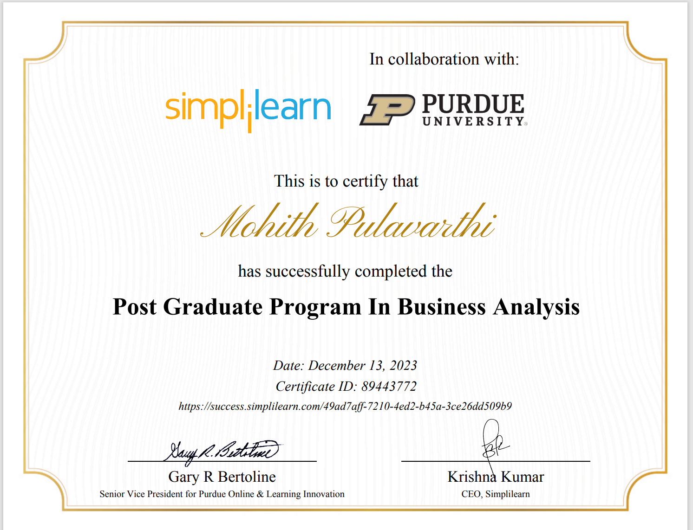
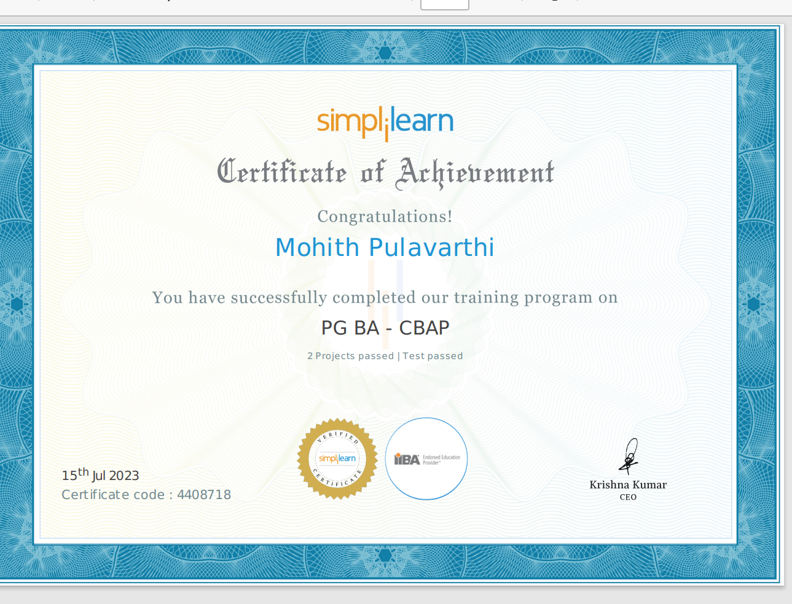
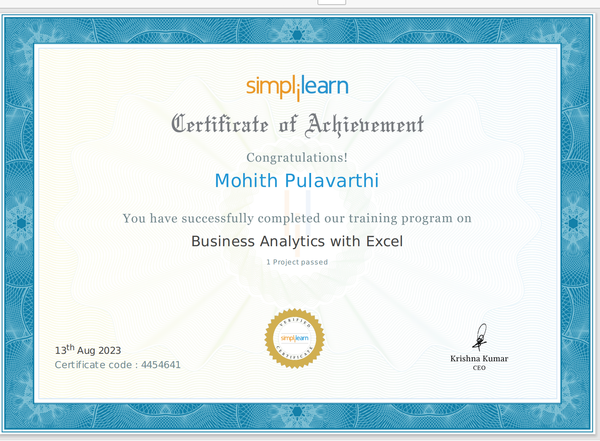
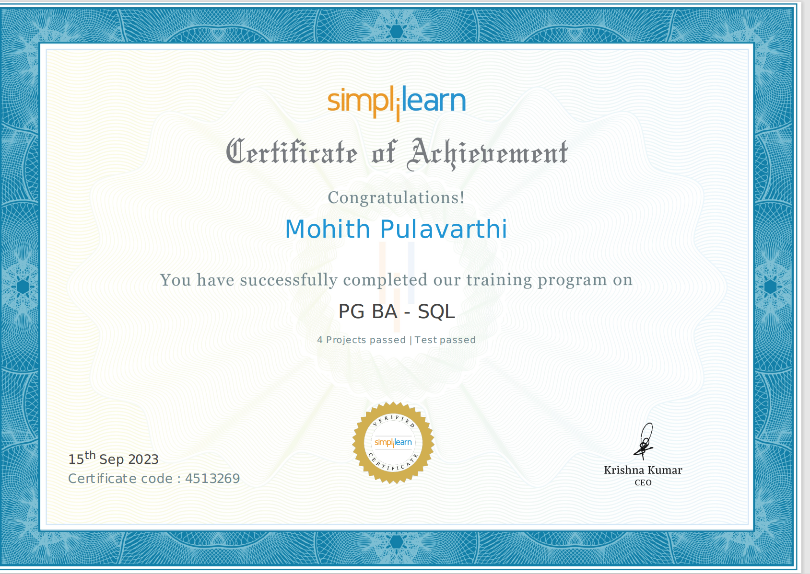
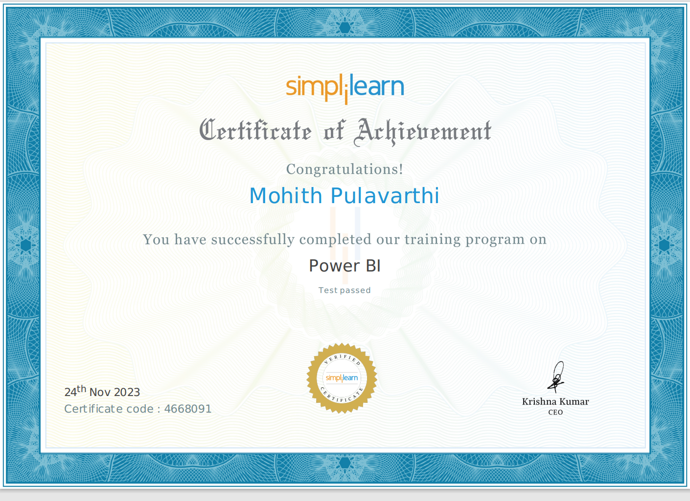
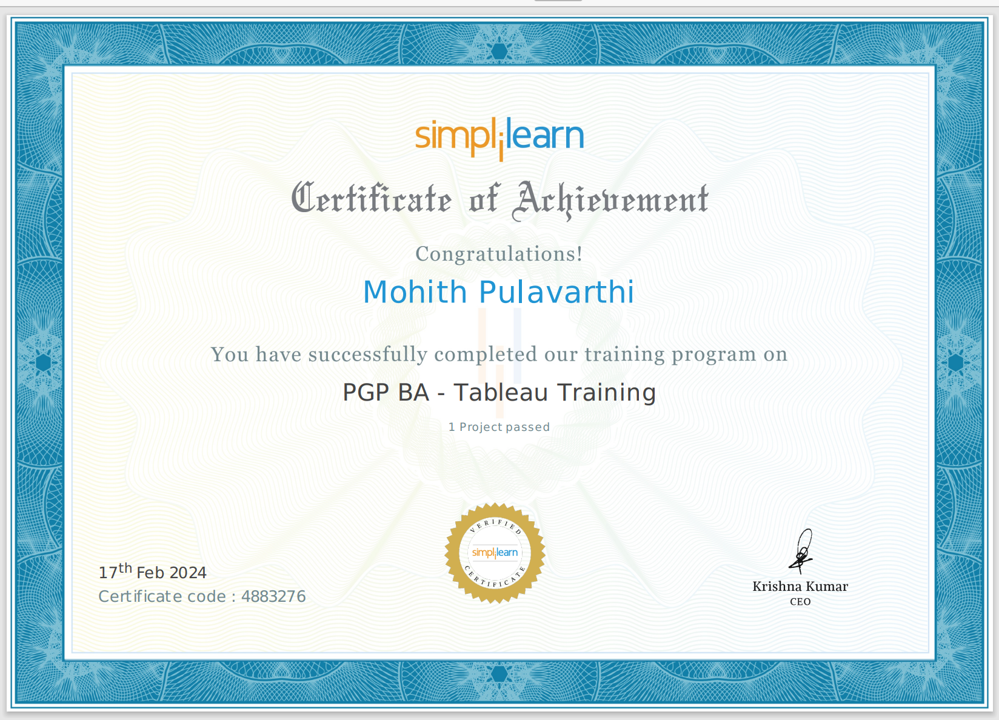
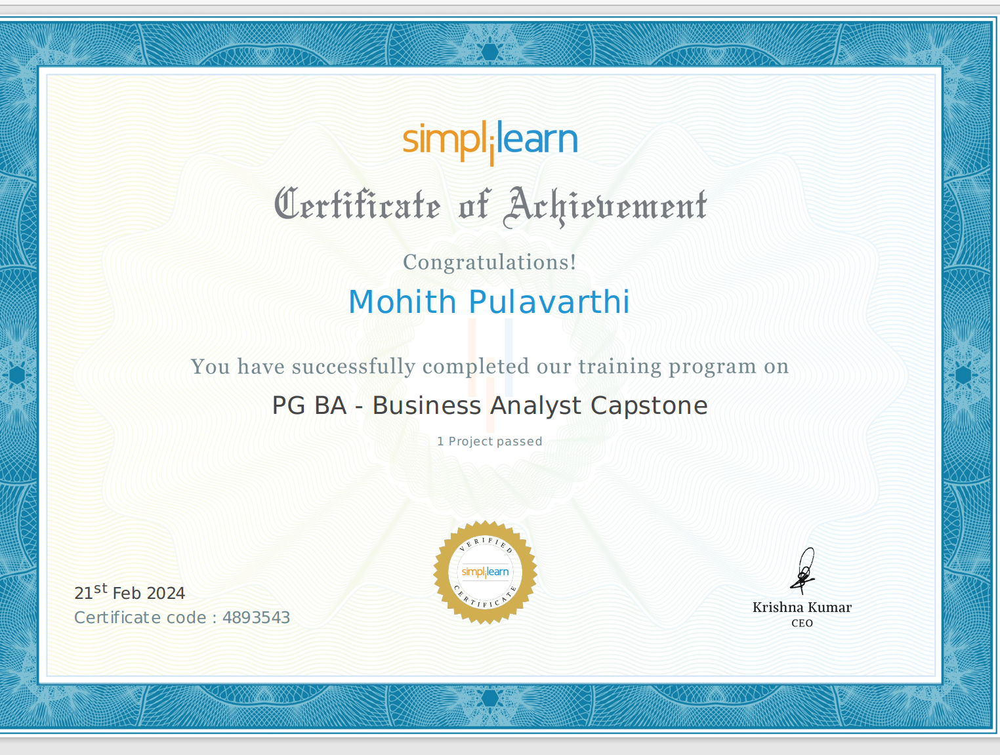

<!DOCTYPE html>
<html lang="en">
<head>
  <meta charset="UTF-8">
  <meta name="viewport" content="width=device-width, initial-scale=1.0">
  <title>Mohith Pulavarthi - Business Analyst</title>
  <link rel="stylesheet" href="https://cdnjs.cloudflare.com/ajax/libs/font-awesome/5.15.4/css/all.min.css">
  
</head>
<body>
  <header>
    

      
      

        

          
          Purdue University
        

         
        

          
          Simplilearn
        

      

      <h1 style="color: #333;">Mohith Pulavarthi</h1>
      
Business Analyst

    

  </header>
  

    

      <h2>Summary</h2>
      
I am a versatile Business Analyst specialized in data analytics. With certifications in business analytics, SQL, and data visualization, I have successfully developed projects such as implementing canteen ordering systems for Unilever and developing digital payment features for WhatsApp Pay. With a bachelor's degree in commerce and hands-on experience, I can drive strategic insights. I’m ready to grow and provide effective solutions.

    

    

      <h2>Skills</h2>
      

        
Power BI

        
Tableau

        
Jira

        
MS Excel

        
SQL

        
Data Visualization

        
Agile

        
Report Making

        
Requirement LCM

        
Business Acumen

        
Collaboration

        
Critical Thinking

        
Project Management

        
Stakeholder Management

        
Adaptability

        
Problem Solving

        
Customer Feedback Handling

      

    

    

      <h2>Projects</h2>
      <ul class="projects">
        <li class="project">
          
          

            <h3>Zomato Data Analysis with Power BI</h3>
            
Completed a comprehensive Power BI project for Zomato, a global restaurant aggregation and meal delivery service. The objective was to examine and assess business performance by consolidating data from multiple Excel files. Key project tasks included data import, transformation, and visualization for easy accessibility and assessment.

            

              <a href="4965784_5183_7699_1_1700808734_zomato project.pdf" target="_blank">Download PDF</a>
            

          

        </li>
        <!-- Add remaining projects here -->
        <li class="project">
          
          

            <h3>WhatsApp Pay Feature Implementation</h3>
            
Had the unique opportunity to collaborate with Facebook as a Business Analyst on a groundbreaking project, WhatsApp Pay, designed to revolutionize digital payments. This feature seamlessly integrated secure payment functionality into WhatsApp, serving a global user base of 2 billion.

            

              <a href="4965784_3988_3899_1_1689364103_Whatsapp Pay Project by mohith_pdf.pdf" target="_blank">Download PDF</a>
            

          

        </li>
        <li class="project">
          
          

            <h3>Canteen Ordering System for Unilever</h3>
            
Led the requirements capture process for the Canteen Ordering System at Unilever, a project aimed at streamlining food ordering and reducing inefficiencies in their UK offices. Achieved a 30% reduction in canteen food wastage within six months following the initial release, exceeding the target of 15%.

            

              <a href="4965784_3988_3897_4_1689364082_uniliver canteen ordering system.pdf" target="_blank">Download PDF</a>
            

          

        </li>
        <li class="project">
          
          

            <h3>Airline Database Management Project</h3>
            
As a Database Administrator (DBA) expert, led a critical project at Air Cargo, an aviation company, aimed at optimizing database management to enhance operational efficiency. The project focused on identifying regular customers, analyzing busiest routes, and generating detailed ticket sales reports to improve the customer experience and operational effectiveness.

            

              <a href="AIR CARGO ANALYSIS by mohith.pdf" target="_blank">Download PDF</a>
            

          

        </li>
        <li class="project">
          
          

            <h3>Restaurant Management System</h3>
            
Collaborated with a celebrity chef to develop a Restaurant Management System, streamlining day-to-day operations, including menu management, table reservations, and sales reporting. Implemented features such as menu categorization, table reservation system, and comprehensive sales reporting.

            

              <a href="restaurant_management_system.pdf" target="_blank">Download PDF</a>
            

          

        </li>
        <li class="project">
          
          

            <h3>Designing a Sales Dashboard in Excel</h3>
            
Created a sales dashboard in Excel for analyzing sales based on various product categories. The dashboard allowed users to visualize sales trends, compare regions, and track performance metrics. Implemented features such as monthly sales tables, region-wise sales analysis, and user-controlled product category filters.

            

              <a href="4965784_3992_6434_4_1691830140_ecommerce sales dashboard project.pdf" target="_blank">Download PDF</a>
            

          

        </li>
        <li class="project">
          
          

            <h3>Comparison of Region Based on Sales</h3>
            
Developed a dashboard to compare sales between two regions for a leading organization. Utilized data visualization techniques to analyze sales performance, identify trends, and suggest improvements. Implemented features such as parameterized region selection, sales summary by region, and comparative analysis charts.

            

              <a href="4965784_3991_6437_1_1707973671_Comparison of Region Based on Sales.pdf" target="_blank">Download PDF</a>
            

          

        </li>
      </ul>
    

    

      <h2>Education</h2>
      
Purdue University, Business Analyst Program (June 2023 - Feb 2024)

      
Bachelor of Commerce in Computer Science and Accounting - Andhra University 
      CGPA: 7/10

      
12th Grade: Major in Mathematics, Physics, and Chemistry (MPC) - Adhitya 
      CGPA: 6.89/10

      
10th Grade - St.Augustine.E.M. High School 
      CGPA: 8.3/10

    

    

      <h2 class="certificates-heading">Certifications</h2>
      

        

          
          

            <a href="pg of purdue university.pdf" target="_blank">Download PDF</a>
          

        

        

          
          

            <a href="cbap.pdf" target="_blank">Download PDF</a>
          

        

        

          
          

            <a href="excel.pdf" target="_blank">Download PDF</a>
          

        

        

          
          

            <a href="sql.pdf" target="_blank">Download PDF</a>
          

        

        

          
          

            <a href="powerbi.pdf" target="_blank">Download PDF</a>
          

        

        

          
          

            <a href="tablue.pdf" target="_blank">Download PDF</a>
          

        

        

          
          

            <a href="capstone.pdf" target="_blank">Download PDF</a>
          

        

      

    

  

  <footer>
    

      
+919515629981 | p.mohith79@gmail.com | Hyderabad, IN | <a href="https://www.linkedin.com/in/pulavarthimohith/">LinkedIn</a>

    

  </footer>
</body>
</html>
